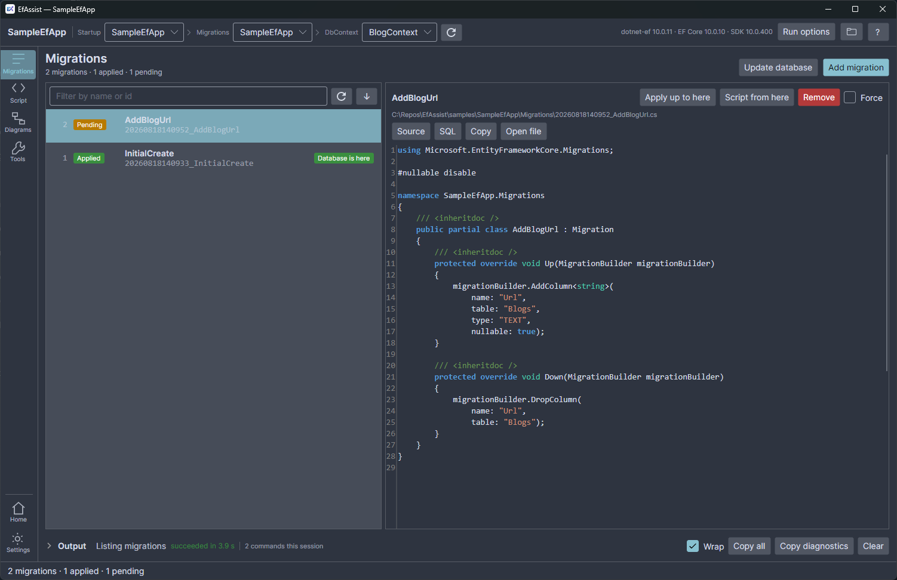

# EfAssist

[](https://github.com/matthewtoghill/EfAssist/actions/workflows/ci.yml)
[](https://github.com/matthewtoghill/EfAssist/releases/latest)
[](LICENSE)

A desktop GUI over the `dotnet ef` CLI, for managing Entity Framework Core migrations. Open a
solution, pick a `DbContext`, and add, apply, roll back, remove and script migrations without
remembering which project is `--project` and which is `--startup-project`.

**[efassist website →](https://matthewtoghill.github.io/EfAssist/)** · **[Download the latest release →](https://github.com/matthewtoghill/EfAssist/releases/latest)**



## What it does

- **Migrations** — every migration with its applied or pending state, and what its `Up` and `Down`
  actually change, in source or as the SQL either direction would run. Add, apply, roll back to any
  point, remove, drop.
- **Script** — `migrations script` between any two migrations, idempotent or not, in a
  syntax-highlighted viewer with Copy and Save As.
- **Diagrams** — your model drawn as an entity-relationship or class diagram, read from the EF model
  snapshot, so it needs no build and no database. Exports to JSON, SVG, PNG, PDF or Mermaid. Pick
  any migration to see the model as of that point in the history, with what it added, removed and
  changed marked up against the migration before it.
- **Tools** — ask EF whether the model has changes not yet in a migration, see exactly what this
  workspace is pointed at, and reach the whole-database actions.
- **Plain-language errors** — the common EF failures explained, with the raw output still one click
  away, and a "Copy diagnostics" button that puts the command line, exit code, full output and tool
  versions on your clipboard.

Every command runs the real `dotnet ef` and streams its output live, cancellable. Nothing is hidden
behind the GUI, and nothing about your database is stored — EfAssist ships no database drivers at
all.

## Install

Download `EfAssist-win-Setup.exe` from the
[latest release](https://github.com/matthewtoghill/EfAssist/releases/latest) and run it. It installs
per-user into `%LocalAppData%\EfAssist` — no administrator rights, no .NET runtime needed.

The installer is not code-signed, so SmartScreen will warn on first run.

`EfAssist-win-Portable.zip` is the same application with no installer and no updates.

`EfAssist-win.msi` is a machine-wide installer for deploying via Group Policy or Intune. It needs
administrator rights and installs the app for every user on the machine; updates still come from the
in-app updater.

You still need the `dotnet-ef` tool itself, which is what the app drives:

```
dotnet tool install --global dotnet-ef
```

The app checks for it at startup and shows the command to copy if it is missing.

Windows x64 is the only published target today. The codebase is cross-platform Avalonia — macOS and
Linux builds are parked in [`docs/dev/ROADMAP.md`](docs/dev/ROADMAP.md) rather than ruled out.

## Updates

An installed build checks GitHub Releases for a newer version shortly after launch and offers it in
a dismissible banner. There is also a "Check for updates" button on the home page. The check is a
read of the public releases feed, and it fails silently when offline.

## Building

You need the .NET 10 SDK and the `dotnet-ef` global tool.

```
dotnet build EfAssist.slnx
dotnet test EfAssist.slnx
dotnet run --project src/EfAssist.App
```

`samples/SampleEfApp` and `samples/SampleRichModel` are throwaway EF Core projects, deliberately
outside the solution, used by the tests and for manual testing. The tests drive the real CLI against
`SampleEfApp`, so they need `blog.db` in its fixture state — see that project's `README.md`.

See [`CONTRIBUTING.md`](CONTRIBUTING.md) if you want to change something.

## Releasing

```powershell
dotnet tool restore
./build/release.ps1                              # build into releases/
./build/release.ps1 -Version 1.1.0 -Upload       # and publish to GitHub Releases
```

`-Upload` needs a GitHub token with `repo` scope, in `-Token` or `GITHUB_TOKEN`. The release number
lives in `<Version>` in `src/EfAssist.App/EfAssist.App.csproj`; `-Version` overrides it.

Keep the contents of `releases/` from the previous release around when building a new one — Velopack
uses them to produce a delta package, so users download a patch rather than the whole application.

## Development record

`docs/dev/` is the working record, kept as it was written rather than tidied up afterwards:

- [`PLAN.md`](docs/dev/PLAN.md) — the agreed scope and the decisions behind it.
- [`PROGRESS.md`](docs/dev/PROGRESS.md) — what is built, verified, and deliberately not done.
- [`ROADMAP.md`](docs/dev/ROADMAP.md) — ideas parked with a reason and a trigger to revisit.

## License

[MIT](LICENSE).
